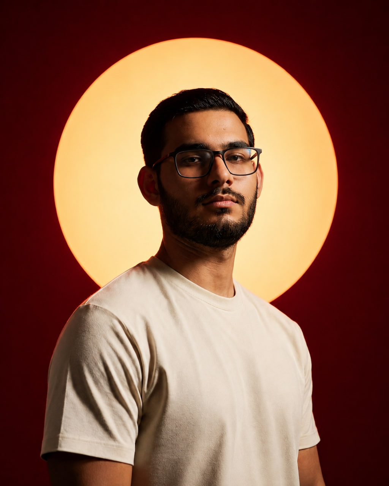

# بورتفوليو حسن أمجد حميد — Hassan Amjad Hamid Portfolio

بورتفوليو شخصي احترافي بتصميم **Neobrutalism UI (الوحشية الجديدة)**، مبنية باستخدام:

- **HTML5**
- **CSS3**
- **Vanilla JavaScript** (بدون أي مكتبات أو أطر عمل خارجية)

> العرربية هي اللغة الافتراضية (RTL) مع دعم كامل للإنجليزية (LTR) وزر تبديل اللغة.

---

## 🎨 المميزات

### التصميم
- حدود سوداء سميكة (4-5px) + زوايا دائرية + ظلال ناعمة قاسية
- لوحة ألوان باستيل (بنفسجي، وردي، أخضر، أصفر)
- بطاقات تفاعلية قابلة للرفع عند التمرير (Hover Lift)
- توهج خلفية يتبع الماوس + مؤشر مخصص
- شبكة خلفية + أشكال عائمة متحركة
- تأثير زجاجي (Glass Effect) على شريط التنقل

### الحركات (Animations)
- Scroll Reveal عند التمرير
- تأثير كتابة متحركة (Typing Effect)
- عدّادات رقمية متحركة + أشرطة مهارات
- Parallax للماوس على صورة البطل
- تأثير تموج عند النقر (Button Ripple)
- شاشة تحميل + زر العودة للأعلى
- انتقال سلس بين اللغتين العربية والإنجليزية

### اللغات
- **العربية** (RTL) افتراضياً — و**الإنجليزية** (LTR)
- كل النصوص موجودة باللغتين وتُبدَّل بنقرة زر
- الحفظ التلقائي لاختيار اللغة في `localStorage`

### SEO
- Meta tags + Open Graph + Twitter Cards
- Favicon خاص (assets/icons/favicon.svg)
- نص بديل (alt) لجميع الصور

---

## 📁 هيكل المشروع

```
portfolio/
├── index.html              # صفحة البورتفوليو الرئيسية
├── style.css               # جميع التنسيقات والحركات
├── script.js               # التفاعلية + قاموس الترجمة
├── README.md
├── generate-images.ps1     # توليد صور .jpg مؤقتة
└── assets/
    ├── images/
    │   ├── profile.svg     ← صورة مؤقتة (استبدلها بصورتك الشخصية)
    │   ├── project1.svg    ← صور مؤقتة (استبدلها بصور مشاريعك)
    │   ├── project2.svg
    │   ├── project3.svg
    │   └── project4.svg
    ├── icons/
    │   └── favicon.svg     ← أيقونة الموقع
    └── fonts/              ← ضع الخطوط المحلية هنا إذا أردت
```

## 🖼️ الصور والاستبدال

في ملف `index.html` توجد **تعليقات بالعربية** تشير إلى مكان كل صورة، مثال:

```html
<!-- صورتك الشخصية: ضع صورتك هنا في assets/images/profile.jpg -->

```

استبدل الصور التالية بصورك الحقيقية:

| الملف | الاستخدام |
|------|-----------|
| `assets/images/profile.jpg` | صورتك الشخصية (مربعة) |
| `assets/images/project1.jpg` | المشروع 1 — نظام إدارة سطح المكتب |
| `assets/images/project2.jpg` | المشروع 2 — تطبيق فلاتر |
| `assets/images/project3.jpg` | المشروع 3 — مشروع ذكاء اصطناعي |
| `assets/images/project4.jpg` | المشروع 4 — موقع ويب |

> الصور المرفقة حالياً (ملفات `.svg`) هي صور Placeholder بألوان باستيل.
> لتوليد صور `.jpg` مؤقتة بنفس الأسلوب شغّل السكريبت:
>
> ```powershell
> powershell -ExecutionPolicy Bypass -File generate-images.ps1
> ```
>
> ثم عدّل في `index.html` الامتداد من `.svg` إلى `.jpg`، أو استبدل الملفات مباشرة بصورك الحقيقية.

---

## 🖼️ الصور والاستبدال

في ملف `index.html` توجد **تعليقات بالعربية** تشير إلى مكان كل صورة، مثال:

```html
<!-- صورتك الشخصية: ضع صورتك هنا في assets/images/profile.jpg -->

```

استبدل الصور التالية بصورك الحقيقية:

| الملف | الاستخدام |
|------|-----------|
| `assets/images/profile.jpg` | صورتك الشخصية (مربعة) |
| `assets/images/project1.jpg` | المشروع 1 — نظام إدارة سطح المكتب |
| `assets/images/project2.jpg` | المشروع 2 — تطبيق فلاتر |
| `assets/images/project3.jpg` | المشروع 3 — مشروع ذكاء اصطناعي |
| `assets/images/project4.jpg` | المشروع 4 — موقع ويب |

> الصور المرفقة حالياً هي صور Placeholder بألوان باستيل. استبدلها بصورك.

---

## 🚀 التشغيل

افتح الملف `index.html` مباشرة في المتصفح، أو شغّل خادماً محلياً:

```bash
# باستخدام Python
python -m http.server 8080

# أو Node.js
npx serve .
```

ثم افتح المتصفح على `http://localhost:8080`.

---

## 🛠️ الأقسام

- **البطل (Hero)** — تحية، اسم، تأثير كتابة، أزرار، صورة شخصية مع ملصقات
- **من أنا (About)** — نبذة + إحصائيات متحركة (العمر / المشاريع / المهارات / الشغف)
- **المهارات (Skills)** — 18 بطاقة مهارة مع أيقونات وأشرطة تقدم متحركة
- **المشاريع (Projects)** — 4 بطاقات مشاريع مميزة
- **المسار (Timeline)** — خط زمني لرحلتك التعليمية
- **الخدمات (Services)** — 5 خدمات
- **التواصل (Contact)** — بطاقة تواصل + شبكة اجتماعية
- **الفوتر (Footer)**

---

## 🔧 تخصيص سريع

- **الألوان:** عدّل المتغيرات في بداية ملف `style.css`
- **الروابط والبيانات الشخصية:** عدّل عناصر `href` وعناوين التواصل في `index.html`
- **الترجمة:** أضف أي نص جديد في قاموس `dict` داخل `script.js`
- **خطوط محلية:** حمّل خطوط Cairo و Space Grotesk وضعها في `assets/fonts/` وعدّل `@font-face` في CSS

## 📄 الترخيص

حر الاستخدام لأي غرض شخصي.
